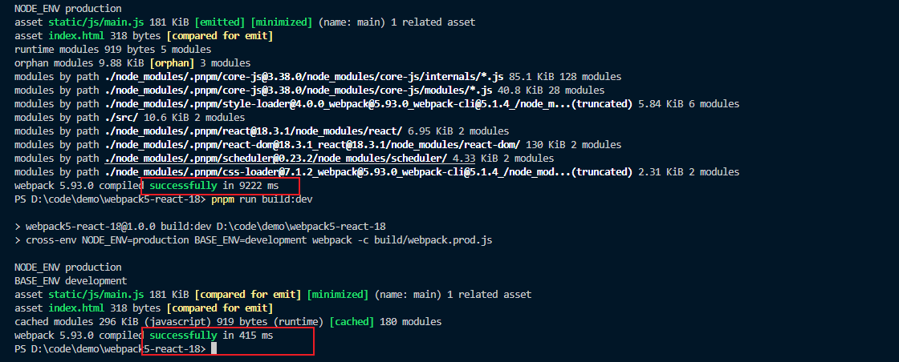

# 初始化项目

build

- webpack.base.js
- webpack.dev.js
- webpack.prod.js

public

- index.html

src

- App.tsx
- index.tsx
  package.json
  tsconfig.json

安装 webpack 依赖
`pnpm i webpack webpack-cli -D`

安装 react 依赖
`pnpm i react react-dom -S`

安装 react 类型依赖
`pnpm i @types/react @types/react-dom -D`

添加 public/index.html 内容

```html
<!DOCTYPE html>
<html lang="en">
  <head>
    <meta charset="UTF-8" />
    <meta http-equiv="X-UA-Compatible" content="IE=edge" />
    <meta name="viewport" content="width=device-width, initial-scale=1.0" />
    <title>webpack5-react-ts</title>
  </head>
  <body>
    <!-- 容器节点 -->
    <div id="root"></div>
  </body>
</html>
```

添加 tsconfig.json 内容

```json
{
  "compilerOptions": {
    "target": "ESNext",
    "lib": ["DOM", "DOM.Iterable", "ESNext"],
    "allowJs": false,
    "skipLibCheck": false,
    "esModuleInterop": false,
    "allowSyntheticDefaultImports": true,
    "strict": true,
    "forceConsistentCasingInFileNames": true,
    "module": "ESNext",
    "moduleResolution": "Node",
    "resolveJsonModule": true,
    "isolatedModules": true,
    "noEmit": true,
    "jsx": "react" // react18这里也可以改成react-jsx
  },
  "include": ["./src"]
}
```

添加 src/App.tsx 内容

```tsx
import React from "react";

function App() {
  return <h2>webpack5-react-ts</h2>;
}
export default App;
```

添加 src/index.tsx 内容添加 src/index.tsx 内容

```tsx
import React from "react";
import { createRoot } from "react-dom/client";
import App from "./App";

const root = document.getElementById("root");
if (root) {
  createRoot(root).render(<App />);
}
```

# 配置基础版 react + ts 环境

## webpack 公共配置

修改 webpack.base.js

### 配置入口文件

```javascript
// webpack.base.js
const path = require("path");

module.exports = {
  entry: path.join(__dirname, "../src/index.tsx"), // 入口文件
};
```

### 配置出口文件

```javascript
// webpack.base.js
const path = require("path");

module.exports = {
  // ...
  // 打包文件出口
  output: {
    filename: "static/js/[name].js", // 每个输出js的名称
    path: path.join(__dirname, "../dist"), // 打包结果输出路径
    clean: true, // webpack4需要配置clean-webpack-plugin来删除dist文件,webpack5内置了
    publicPath: "/", // 打包后文件的公共前缀路径
  },
};
```

### 配置 loader 解析 ts 和 jsx

由于 webpack 默认只能识别 js 文件,不能识别 jsx 语法,
需要配置 loader 的预设预设 @babel/preset-typescript 来先 ts 语法转换为 js 语法,
再借助预设 @babel/preset-react 来识别 jsx 语法。

**安装 babel 核心模块和 babel 预设**

`pnpm i babel-loader @babel/core @babel/preset-react @babel/preset-typescript -D`

### 在 webpack.base.js 添加 module.rules 配置

```javascript
// webpack.base.js
module.exports = {
  // ...
  module: {
    rules: [
      {
        test: /.(ts|tsx)$/, // 匹配.ts, tsx文件
        use: {
          loader: "babel-loader",
          options: {
            // 预设执行顺序由右往左,所以先处理ts,再处理jsx
            presets: ["@babel/preset-react", "@babel/preset-typescript"],
          },
        },
      },
    ],
  },
};
```

### 配置 extensions

extensions 是 webpack 的 resolve 解析配置下的选项，在引入模块时不带文件后缀时，
会来该配置数组里面依次添加后缀查找文件，
因为 ts 不支持引入以 .ts, tsx 为后缀的文件，所以要在 extensions 中配置，
而第三方库里面很多引入 js 文件没有带后缀，所以也要配置下 js

**修改 webpack.base.js，注意把高频出现的文件后缀放在前面**

```javascript
// webpack.base.js
module.exports = {
  // ...
  resolve: {
    extensions: [".js", ".tsx", ".ts"],
  },
};
```

这里只配置 js, tsx 和 ts，其他文件引入都要求带后缀，可以提升构建速度。

### 添加 html-webpack-plugin 插件

webpack 需要把最终构建好的静态资源都引入到一个 html 文件中,这样才能在浏览器中运行,
html-webpack-plugin 就是来做这件事情的,安装依赖：
`pnpm i html-webpack-plugin -D`

因为该插件在开发和构建打包模式都会用到,所以还是放在公共配置 webpack.base.js 里面

```javascript
// webpack.base.js
const path = require("path");
const HtmlWebpackPlugin = require("html-webpack-plugin");

module.exports = {
  // ...
  plugins: [
    new HtmlWebpackPlugin({
      template: path.resolve(__dirname, "../public/index.html"), // 模板取定义root节点的模板
      inject: true, // 自动注入静态资源
    }),
  ],
};
```

到这里一个最基础的 react 基本公共配置就已经配置好了,需要在此基础上分别配置开发环境和打包环境了。

## webpack 开发环境配置

### 安装 webpack-dev-server

开发环境配置代码在 webpack.dev.js 中,需要借助 webpack-dev-server 在开发环境启动服务器来辅助开发,还需要依赖 webpack-merge 来合并基本配置,安装依赖:

`pnpm i webpack-dev-server webpack-merge -D`

修改 webpack.dev.js 代码, 合并公共配置，并添加开发模式配置

```javascript
// webpack.dev.js
const path = require("path");
const { merge } = require("webpack-merge");
const baseConfig = require("./webpack.base.js");

// 合并公共配置,并添加开发环境配置
module.exports = merge(baseConfig, {
  mode: "development", // 开发模式,打包更加快速,省了代码优化步骤
  devtool: "eval-cheap-module-source-map", // 源码调试模式,后面会讲
  devServer: {
    port: 3000, // 服务端口号
    compress: false, // gzip压缩,开发环境不开启,提升热更新速度
    hot: true, // 开启热更新，后面会讲react模块热替换具体配置
    historyApiFallback: true, // 解决history路由404问题
    static: {
      directory: path.join(__dirname, "../public"), //托管静态资源public文件夹
    },
  },
});
```

### package.json 添加 dev 脚本

在 package.json 的 scripts 中添加

```javascript
// package.json
"scripts": {
  "dev": "webpack-dev-server -c build/webpack.dev.js"
},
```

### webpack 打包环境配置

**修改 webpack.prod.js 代码**

```javascript
// webpack.prod.js

const { merge } = require("webpack-merge");
const baseConfig = require("./webpack.base.js");
module.exports = merge(baseConfig, {
  mode: "production", // 生产模式,会开启tree-shaking和压缩代码,以及其他优化
});
```

**package.json 添加 build 打包命令脚本**

在 package.json 的 scripts 中添加 build 打包命令

```javascript
"scripts": {
    "dev": "webpack-dev-server -c build/webpack.dev.js",
    "build": "webpack -c build/webpack.prod.js"
},
```

执行 npm run build,最终打包在 dist 文件中, 打包结果:

```markdown
dist  
├── static
| ├── js
| ├── main.js
├── index.html
```

**浏览器查看打包结果**

打包后的 dist 文件可以在本地借助 node 服务器 serve 打开,全局安装 serve

`pnpm i serve -g`

然后在项目根目录命令行执行 serve -s dist,就可以启动打包后的项目了。
到现在一个基础的支持 react 和 ts 的 webpack5 就配置好了,但只有这些功能是远远不够的,还需要继续添加其他配置。

# 基础功能配置

## 配置环境变量

环境变量按作用来分分两种

- 区分是开发模式还是打包构建模式
- 区分项目业务环境,开发/测试/预测/正式环境

区分开发模式还是打包构建模式可以用 process.env.NODE_ENV,因为很多第三方包里面判断都是采用的这个环境变量。

区分项目接口环境可以自定义一个环境变量 process.env.BASE_ENV,设置环境变量可以借助 cross-env 和 webpack.DefinePlugin 来设置

- cross-env：兼容各系统的设置环境变量的包
- webpack.DefinePlugin：webpack 内置的插件,可以为业务代码注入环境变量

## 安装 cross-env

`pnpm i cross-env -D`

修改 package.json 的 scripts 脚本字段,删除原先的 dev 和 build,改为

```javascript
"scripts": {
    "dev:dev": "cross-env NODE_ENV=development BASE_ENV=development webpack-dev-server -c build/webpack.dev.js",
    "dev:test": "cross-env NODE_ENV=development BASE_ENV=test webpack-dev-server -c build/webpack.dev.js",
    "dev:pre": "cross-env NODE_ENV=development BASE_ENV=pre webpack-dev-server -c build/webpack.dev.js",
    "dev:prod": "cross-env NODE_ENV=development BASE_ENV=production webpack-dev-server -c build/webpack.dev.js",

    "build:dev": "cross-env NODE_ENV=production BASE_ENV=development webpack -c build/webpack.prod.js",
    "build:test": "cross-env NODE_ENV=production BASE_ENV=test webpack -c build/webpack.prod.js",
    "build:pre": "cross-env NODE_ENV=production BASE_ENV=pre webpack -c build/webpack.prod.js",
    "build:prod": "cross-env NODE_ENV=production BASE_ENV=production webpack -c build/webpack.prod.js",
  },
```

dev 开头是开发模式,build 开头是打包模式,冒号后面对应的
dev/test/pre/prod 是对应的业务环境的开发/测试/预测/正式环境。

process.env.NODE_ENV 环境变量 webpack 会自动根据设置的 mode 字段来给业务代码注入对应的 development 和 prodction,
这里在命令中再次设置环境变量 NODE_ENV 是为了在 webpack 和 babel 的配置文件中访问到。

在 webpack.base.js 中打印一下设置的环境变量

```javascript
// webpack.base.js
// ...
console.log("NODE_ENV", process.env.NODE_ENV);
console.log("BASE_ENV", process.env.BASE_ENV);
```

执行 npm run build:dev,可以看到打印的信息

```javascript
// NODE_ENV production
// BASE_ENV development
```

当前是打包模式,业务环境是开发环境,这里需要把 process.env.BASE_ENV 注入到业务代码里面,
就可以通过该环境变量设置对应环境的接口地址和其他数据,要借助 webpack.DefinePlugin 插件。

**修改 webpack.base.js**

```javascript
// webpack.base.js
// ...
const webpack = require("webpack");
module.export = {
  // ...
  plugins: [
    // ...
    new webpack.DefinePlugin({
      "process.env.BASE_ENV": JSON.stringify(process.env.BASE_ENV),
    }),
  ],
};
```

配置后会把值注入到业务代码里面去,webpack 解析代码匹配到 process.env.BASE_ENV,
就会设置到对应的值。测试一下，在 src/index.tsx 打印一下两个环境变量

```javascript
// src/index.tsx
// ...
console.log("NODE_ENV", process.env.NODE_ENV);
console.log("BASE_ENV", process.env.BASE_ENV);
```

## 处理 css 和 less 文件

在 src 下新增 app.css

```css
h2 {
  color: red;
  transform: translateY(100px);
}
```

在 src/App.tsx 中引入 app.css

```javascript
import React from "react";
import "./app.css";

function App() {
  return <h2>webpack5-rea11ct-ts</h2>;
}
export default App;
```

执行打包命令 npm run build:dev,会发现有报错, 因为 webpack 默认只认识 js,
是不识别 css 文件的,需要使用 loader 来解析 css, 安装依赖

`npm i style-loader css-loader -D`

- style-loader: 把解析后的 css 代码从 js 中抽离,放到头部的 style 标签中(在运行时做的)
- css-loader: 解析 css 文件代码
- scss-loader: 解析 scss 文件代码

因为解析 css 的配置开发和打包环境都会用到,所以加在公共配置 webpack.base.js 中

```javascript
// webpack.base.js
// ...
module.exports = {
  // ...
  module: {
    rules: [
      // ...
      {
        test: /.(css|scss)$/, //匹配 css 文件
        use: ["style-loader", "css-loader", "sass-loader"],
      },
    ],
  },
  // ...
};
```

上面提到过,loader 执行顺序是从右往左,从下往上的,
匹配到 css 文件后先用 css-loader 解析 css,
最后借助 style-loader 把 css 插入到头部 style 标签中。

配置完成后再 npm run build:dev 打包,借助 serve -s dist 启动后在浏览器查看,可以看到样式生效了。

## 处理 css3 前缀兼容

虽然 css3 现在浏览器支持率已经很高了, 但有时候需要兼容一些低版本浏览器,
需要给 css3 加前缀,可以借助插件来自动加前缀, postcss-loader 就是来给 css3 加浏览器前缀的,安装依赖：

`pnpm i postcss-loader autoprefixer -D`

- postcss-loader：处理 css 时自动加前缀
- autoprefixer：决定添加哪些浏览器前缀到 css 中

修改 webpack.base.js, 在解析 css 和 less 的规则中添加配置

```javascript
module.exports = {
  // ...
  module: {
    rules: [
      // ...
      {
        test: /.(css|less)$/, //匹配 css和less 文件
        use: [
          "style-loader",
          "css-loader",
          // 新增
          {
            loader: "postcss-loader",
            options: {
              postcssOptions: {
                plugins: ["autoprefixer"],
              },
            },
          },
          "less-loader",
        ],
      },
    ],
  },
  // ...
};
```

配置完成后,需要有一份要兼容浏览器的清单,让 postcss-loader 知道要加哪些浏览器的前缀,在根目录创建 .browserslistrc 文件

```javascript
IE 9 # 兼容IE 9
chrome 35 # 兼容chrome 35
```

postcss.config.js 是 postcss-loader 的配置文件,会自动读取配置,根目录新建 postcss.config.js：

```javascript
module.exports = {
  plugins: ["autoprefixer"],
};
```

修改 webpack.base.js, 取消 postcss-loader 的 options 配置

```javascript
// webpack.base.js
// ...
module.exports = {
  // ...
  module: {
    rules: [
      // ...
      {
        test: /.(css|less)$/, //匹配 css和less 文件
        use: ["style-loader", "css-loader", "postcss-loader", "less-loader"],
      },
    ],
  },
  // ...
};
```

提取 postcss-loader 配置后,再次打包,可以看到依然可以解析 css, less 文件, css3 对应前缀依然存在。

## babel 预设处理 js 兼容

现在 js 不断新增很多方便好用的标准语法来方便开发,甚至还有非标准语法比如装饰器,都极大的提升了代码可读性和开发效率。
但前者标准语法很多低版本浏览器不支持,后者非标准语法所有的浏览器都不支持。
需要把最新的标准语法转换为低版本语法,把非标准语法转换为标准语法才能让浏览器识别解析,
而 babel 就是来做这件事的,这里只讲配置,更详细的可以看 [Babel 那些事儿](https://juejin.cn/post/6992371845349507108)。

**安装依赖**

`pnpm i babel-loader @babel/core @babel/preset-env core-js -D`

- babel-loader: 使用 babel 加载最新 js 代码并将其转换为 ES5（上面已经安装过）
- @babel/corer: babel 编译的核心包
- @babel/preset-env: babel 编译的预设,可以转换目前最新的 js 标准语法
- core-js: 使用低版本 js 语法模拟高版本的库,也就是垫片

```javascript
// webpack.base.js
module.exports = {
  // ...
  module: {
    rules: [
      {
        test: /.(ts|tsx)$/,
        use: {
          loader: "babel-loader",
          options: {
            // 执行顺序由右往左,所以先处理ts,再处理jsx,最后再试一下babel转换为低版本语法
            presets: [
              [
                "@babel/preset-env",
                {
                  // 设置兼容目标浏览器版本,这里可以不写,babel-loader会自动寻找上面配置好的文件.browserslistrc
                  // "targets": {
                  //  "chrome": 35,
                  //  "ie": 9
                  // },
                  useBuiltIns: "usage", // 根据配置的浏览器兼容,以及代码中使用到的api进行引入polyfill按需添加
                  corejs: 3, // 配置使用core-js低版本
                },
              ],
              "@babel/preset-react",
              "@babel/preset-typescript",
            ],
          },
        },
      },
    ],
  },
};
```

此时再打包就会把语法转换为对应浏览器兼容的语法了。

为了避免 webpack 配置文件过于庞大,可以把 babel-loader 的配置抽离出来,
新建 babel.config.js 文件,使用 js 作为配置文件,是因为可以访问到 process.env.NODE_ENV 环境变量来区分是开发还是打包模式。

```javascript
// babel.config.js
module.exports = {
  // 执行顺序由右往左,所以先处理ts,再处理jsx,最后再试一下babel转换为低版本语法
  presets: [
    [
      "@babel/preset-env",
      {
        // 设置兼容目标浏览器版本,这里可以不写,babel-loader会自动寻找上面配置好的文件.browserslistrc
        // "targets": {
        //  "chrome": 35,
        //  "ie": 9
        // },
        useBuiltIns: "usage", // 根据配置的浏览器兼容,以及代码中使用到的api进行引入polyfill按需添加
        corejs: 3, // 配置使用core-js使用的版本
      },
    ],
    "@babel/preset-react",
    "@babel/preset-typescript",
  ],
};
```

移除 webpack.base.js 中 babel-loader 的 options 配置

```javascript
// webpack.base.js
module.exports = {
  // ...
  module: {
    rules: [
      {
        test: /.(ts|tsx)$/,
        use: "babel-loader",
      },
      // 如果node_moduels中也有要处理的语法，可以把js|jsx文件配置加上
      // {
      //  test: /.(js|jsx)$/,
      //  use: 'babel-loader'
      // }
      // ...
    ],
  },
};
```

## babel 处理 js 非标准语法

现在 react 主流开发都是函数组件和 react-hooks,但有时也会用类组件,可以用装饰器简化代码。

新增 src/components/Class.tsx 组件, 在 App.tsx 中引入该组件使用

```javascript
import React, { PureComponent } from "react";

// 装饰器为,组件添加age属性
function addAge(Target: Function) {
  Target.prototype.age = 111
}
// 使用装饰圈
@addAge
class Class extends PureComponent {

  age?: number

  render() {
    return (
      <h2>我是类组件---{this.age}</h2>
    )
  }
}

export default Class
```

上面 Class 组件代码中使用了装饰器,目前 js 标准语法是不支持的,现在运行或者打包会报错,不识别装饰器语法,需要借助 babel-loader 插件,安装依赖
`pnpm i @babel/plugin-proposal-decorators -D`

在 babel.config.js 中添加插件

```javascript
module.exports = {
  // ...
  plugins: [["@babel/plugin-proposal-decorators", { legacy: true }]],
};
```

## 复制 public 文件夹

一般 public 文件夹都会放一些静态资源,可以直接根据绝对路径引入,比如图片,css,js 文件等,不需要 webpack 进行解析,
只需要打包的时候把 public 下内容复制到构建出口文件夹中,可以借助 [copy-webpack-plugin](https://www.npmjs.com/package/copy-webpack-plugin) 插件,安装依赖
`pnpm i copy-webpack-plugin -D`

开发环境已经在 devServer 中配置了 static 托管了 public 文件夹,在开发环境使用绝对路径可以访问到 public 下的文件,但打包构建时不做处理会访问不到,所以现在需要在打包配置文件 webpack.prod.js 中新增 copy 插件配置。

```javascript
// webpack.prod.js
// ..
const path = require("path");
const CopyPlugin = require("copy-webpack-plugin");
module.exports = merge(baseConfig, {
  mode: "production",
  plugins: [
    // 复制文件插件
    new CopyPlugin({
      patterns: [
        {
          from: path.resolve(__dirname, "../public"), // 复制public下文件
          to: path.resolve(__dirname, "../dist"), // 复制到dist目录中
          filter: (source) => {
            return !source.includes("index.html"); // 忽略index.html
          },
        },
      ],
    }),
  ],
});
```

在上面的配置中,忽略了 index.html,因为 html-webpack-plugin 会以 public 下的 index.html 为模板生成一个 index.html 到 dist 文件下,所以不需要再复制该文件了。

测试一下,在 public 中新增一个 favicon.ico 图标文件,在 index.html 中引入

```javascript
<!DOCTYPE html>
<html lang="en">
<head>
  <meta charset="UTF-8">
  <!-- 绝对路径引入图标文件 -->
  <link data-n-head="ssr" rel="icon" type="image/x-icon" href="/favicon.ico">
  <meta http-equiv="X-UA-Compatible" content="IE=edge">
  <meta name="viewport" content="width=device-width, initial-scale=1.0">
  <title>webpack5-react-ts</title>
</head>
<body>
  <!-- 容器节点 -->
  <div id="root"></div>
</body>
</html>
```

再执行 npm run build:dev 打包,就可以看到 public 下的 favicon.ico 图标文件被复制到 dist 文件中了。

## 处理图片文件

对于图片文件,webpack4 使用 file-loader 和 url-loader 来处理的,但 webpack5 不使用这两个 loader 了,而是采用自带的 [asset-module](https://webpack.js.org/guides/asset-modules/#root) 来处理

修改 webpack.base.js,添加图片解析配置

```javascript
module.exports = {
  module: {
    rules: [
      // ...
      {
        test: /.(png|jpg|jpeg|gif|svg)$/, // 匹配图片文件
        type: "asset", // type选择asset
        parser: {
          dataUrlCondition: {
            maxSize: 10 * 1024, // 小于10kb转base64位
          },
        },
        generator: {
          filename: "static/images/[name][ext]", // 文件输出目录和命名
        },
      },
    ],
  },
};
```

测试一下,准备一张小于 10kb 的图片和大于 10kb 的图片,放在 src/assets/imgs 目录下, 修改 App.tsx:

```javascript
import React from "react";
import smallImg from "./assets/imgs/5kb.png";
import bigImg from "./assets/imgs/22kb.png";
import "./app.css";
import "./app.less";

function App() {
  return (
    <>
      
      
    </>
  );
}
export default App;
```

这个时候在引入图片的地方会报：找不到模块“./assets/imgs/22kb.png”或其相应的类型声明，需要添加一个图片的声明文件

新增 src/images.d.ts 文件，添加内容

```javascript
declare module '*.svg'
declare module '*.png'
declare module '*.jpg'
declare module '*.jpeg'
declare module '*.gif'
declare module '*.bmp'
declare module '*.tiff'
declare module '*.less'
declare module '*.css'
```

添加图片声明文件后,就可以正常引入图片了, 然后执行 npm run build:dev 打包,借助 serve -s dist 查看效果,
可以看到可以正常解析图片了,并且小于 10kb 的图片被转成了 base64 位格式的。

css 中的背景图片一样也可以解析,修改 app.tsx。

```javascript
import React from "react";
import smallImg from "./assets/imgs/5kb.png";
import bigImg from "./assets/imgs/22kb.png";
import "./app.css";
import "./app.less";

function App() {
  return (
    <>
      
      
      <div className="smallImg"></div> {/* 小图片背景容器 */}
      <div className="bigImg"></div> {/* 大图片背景容器 */}
    </>
  );
}
export default App;
```

## 处理字体和媒体文件

字体文件和媒体文件这两种资源处理方式和处理图片是一样的,只需要把匹配的路径和打包后放置的路径修改一下就可以了。修改 webpack.base.js 文件

```javascript
// webpack.base.js
module.exports = {
  module: {
    rules: [
      // ...
      {
        test: /.(woff2?|eot|ttf|otf)$/, // 匹配字体图标文件
        type: "asset", // type选择asset
        parser: {
          dataUrlCondition: {
            maxSize: 10 * 1024, // 小于10kb转base64位
          },
        },
        generator: {
          filename: "static/fonts/[name][ext]", // 文件输出目录和命名
        },
      },
      {
        test: /.(mp4|webm|ogg|mp3|wav|flac|aac)$/, // 匹配媒体文件
        type: "asset", // type选择asset
        parser: {
          dataUrlCondition: {
            maxSize: 10 * 1024, // 小于10kb转base64位
          },
        },
        generator: {
          filename: "static/media/[name][ext]", // 文件输出目录和命名
        },
      },
    ],
  },
};
```

# 配置 react 模块热更新

热更新上面已经在 devServer 中配置 hot 为 true, 在 webpack4 中,还需要在插件中添加了 HotModuleReplacementPlugin,
在 webpack5 中,只要 devServer.hot 为 true 了,该插件就已经内置了。

现在开发模式下修改 css 和 less 文件，页面样式可以在不刷新浏览器的情况实时生效，因为此时样式都在 style 标签里面，style-loader 做了替换样式的热替换功能。但是修改 App.tsx,浏览器会自动刷新后再显示修改后的内容,但我们想要的不是刷新浏览器,而是在不需要刷新浏览器的前提下模块热更新,并且能够保留 react 组件的状态。

`pnpm i @pmmmwh/react-refresh-webpack-plugin react-refresh -D`

配置 react 热更新插件,修改 webpack.dev.js

```javascript
// webpack.dev.js
const ReactRefreshWebpackPlugin = require("@pmmmwh/react-refresh-webpack-plugin");

module.exports = merge(baseConfig, {
  // ...
  plugins: [
    new ReactRefreshWebpackPlugin(), // 添加热更新插件
  ],
});
```

为 babel-loader 配置 react-refesh 刷新插件,修改 babel.config.js 文件

```javascript
const isDEV = process.env.NODE_ENV === "development"; // 是否是开发模式
module.exports = {
  // ...
  plugins: [
    isDEV && require.resolve("react-refresh/babel"), // 如果是开发模式,就启动react热更新插件
    // ...
  ].filter(Boolean), // 过滤空值
};
```

# 优化构建速度

## 构建耗时分析

当进行优化的时候,肯定要先知道时间都花费在哪些步骤上了,而 speed-measure-webpack-plugin 插件可以帮我们做到,安装依赖：

`pnpm i speed-measure-webpack-plugin -D`

使用的时候为了不影响到正常的开发/打包模式,我们选择新建一个配置文件,新增 webpack 构建分析配置文件 build/webpack.analy.js

```javascript
const prodConfig = require("./webpack.prod.js"); // 引入打包配置
const SpeedMeasurePlugin = require("speed-measure-webpack-plugin"); // 引入webpack打包速度分析插件
const smp = new SpeedMeasurePlugin(); // 实例化分析插件
const { merge } = require("webpack-merge"); // 引入合并webpack配置方法

// 使用smp.wrap方法,把生产环境配置传进去,由于后面可能会加分析配置,所以先留出合并空位
module.exports = smp.wrap(merge(prodConfig, {}));
```

修改 package.json 添加启动 webpack 打包分析脚本命令,在 scripts 新增：

```javascript
{
  // ...
  "scripts": {
    // ...
    "build:analy": "cross-env NODE_ENV=production BASE_ENV=production webpack -c build/webpack.analy.js"
  }
  // ...
}
```

执行 npm run build:analy 命令


可以在图中看到各**plugin**和**loader**的耗时时间,现在因为项目内容比较少,所以耗时都比较少,在真正的项目中可以通过这个来分析打包时间花费在什么地方,然后来针对性的优化

## 开启持久化存储缓存

在**webpack5**之前做缓存是使用**babel-loader**缓存解决**js**的解析结果,**cache-loader**缓存**css**等资源的解析结果,还有模块缓存插件**hard-source-webpack-plugin**,配置好缓存后第二次打包,通过对文件做哈希对比来验证文件前后是否一致,如果一致则采用上一次的缓存,可以极大地节省时间。

**webpack5** 较于 **webpack4**,新增了持久化缓存、改进缓存算法等优化,通过配置 webpack 持久化缓存,来缓存生成的 **webpack** 模块和 **chunk**,改善下一次打包的构建速度,可提速 **90%** 左右,配置也简单，修改**webpack.base.js**

```javascript
// webpack.base.js
// ...
module.exports = {
  // ...
  cache: {
    type: "filesystem", // 使用文件缓存
  },
};
```

可以看出来，第一次耗时 9222ms, 第二次耗时 415ms

缓存的存储位置在**node_modules/.cache/webpack**,里面又区分了**development**和**production**缓存

## 开启多线程 loader

**webpack**的**loader**默认在单线程执行,现代电脑一般都有多核**cpu**,可以借助多核**cpu**开启多线程**loader**解析,可以极大地提升**loader**解析的速度,[thread-loader](https://link.juejin.cn/?target=https%3A%2F%2Fwebpack.docschina.org%2Floaders%2Fthread-loader%2F%23root)就是用来开启多进程解析**loader**的,安装依赖

`pnpm i thread-loader -D`

使用时,需将此 **loader** 放置在其他 **loader** 之前。放置在此 **loader** 之后的 **loader** 会在一个独立的 **worker** 池中运行。

修改**webpack.base.js**

```javascript
// webpack.base.js
module.exports = {
  // ...
  module: {
    rules: [
      {
        test: /.(ts|tsx)$/,
        use: ["thread-loader", "babel-loader"],
      },
    ],
  },
};
```

由于**thread-loader**不支持抽离 css 插件**MiniCssExtractPlugin.loader**(下面会讲),所以这里只配置了多进程解析**js**,开启多线程也是需要启动时间,大约**600ms**左右,所以适合规模比较大的项目。

## 配置 alias 别名

**webpack**支持设置别名**alias**,设置别名可以让后续引用的地方减少路径的复杂度。
修改**webpack.base.js**

```js
module.export = {
  // ...
  resolve: {
    // ...
    alias: {
      "@": path.join(__dirname, "../src"),
    },
  },
};
```

修改**tsconfig.json**,添加**baseUrl**和**paths**

```js
{
  "compilerOptions": {
    // ...
    "baseUrl": ".",
    "paths": {
      "@/*": [
        "src/*"
      ]
    }
  }
}
```

配置修改完成后,在项目中使用 **@/xxx.xx**,就会指向项目中**src/xxx.xx,**在**js/ts**文件和**css**文件中都可以用。\

## 缩小 loader 作用范围

一般第三库都是已经处理好的,不需要再次使用**loader**去解析,可以按照实际情况合理配置**loader**的作用范围,来减少不必要的**loader**解析,节省时间,通过使用 **include**和**exclude** 两个配置项,可以实现这个功能,常见的例如：

- **include**：只解析该选项配置的模块
- **exclude**：不解该选项配置的模块,优先级更高

修改**webpack.base.js**
